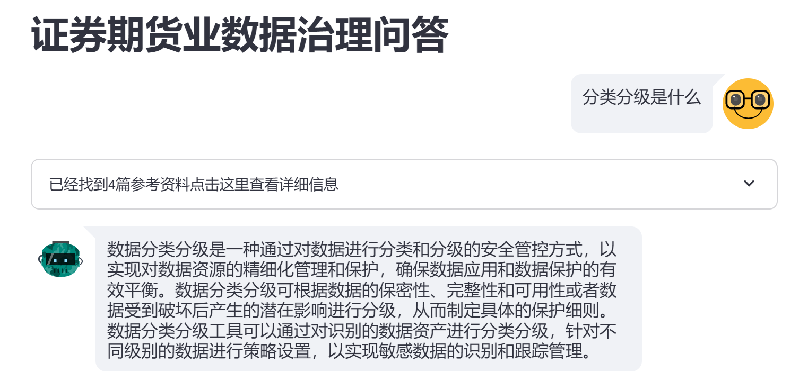

2024/5/22 更新 增加了检索sourse清单及下载功能

可在CPU运行的本地RAG，采用Qwen0.5B和bge-small-zh-v1.5，

配置要求：个人电脑，8G内存以上。

该DEMO中包含了证券业相关制度文档和数据治理相关文档

部署步骤

安装所需要的包 

pip install -r requirement.txt

下载模型

$env:HF_ENDPOINT = "https://hf-mirror.com"

huggingface-cli download --resume-download Qwen/Qwen1.5-0.5B-Chat --local-dir Qwen1.5-0.5B-Chat

运行程序

$env:HF_ENDPOINT = "https://hf-mirror.com"

streamlit run .\appUI.py

添加自己的文档
将PDF文件放置RAG-FILES目录下，运行embedding-doc.py

请注意，由于CPU性能限制，进行模型推理可能需要5-20分钟的处理时间。
运行截图如下：

